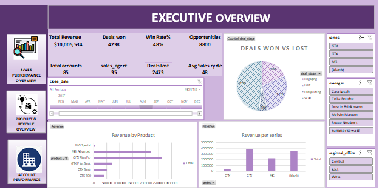
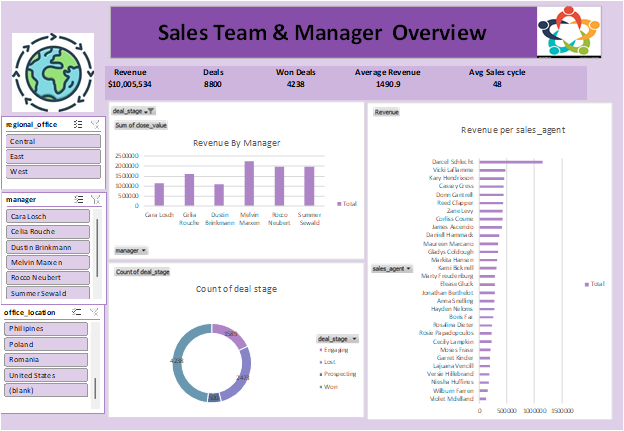
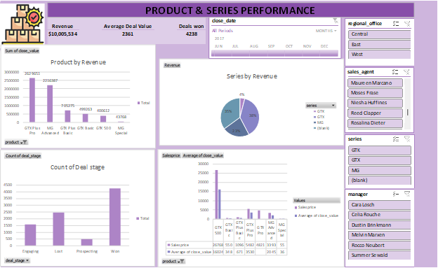
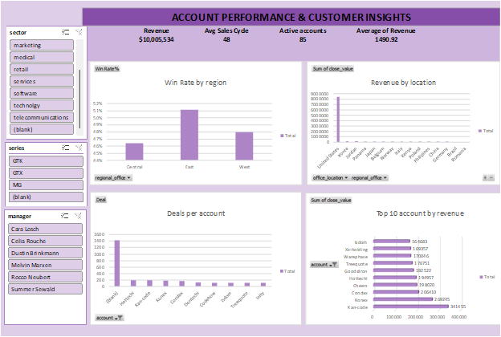

# CRM Sales Pipeline Analysis

## 📌 Project Overview
This project analyzes a B2B CRM sales pipeline dataset from a fictitious computer hardware company.  
The goal is to evaluate **sales performance**, **product effectiveness**, and **account contributions** using Excel dashboards and business metrics.

---

## 🎯 Business Questions Answered
- How is each sales team and agent performing?
- Which products generate the highest revenue and win rates?
- Which accounts and sectors contribute most to revenue?
- What factors influence deal success and sales cycle length?

---

## 📊 Key Dashboards
### 1️⃣ Sales Performance Overview
**KPIs:**
- Total Revenue: **$10,005,534**
- Won Deals: **511**
- Average Sales Cycle: **48 days**

**Insights:**
- Top Sales Agent: **Parcel Schlecht ($1,153,214)**
- Lowest Performing Agent: **Violet McClelland ($12,431)**
- Top Manager by Revenue: **Melvin Marxen**

---

### 2️⃣ Product Performance Dashboard
**Metrics Used:**
- Total Revenue
- Average Deal Value
- Won Deals

**Insights:**
- Highest Revenue Product: **GTX Plus Pro ($2,629,651)**
- Highest Revenue Series: **GTX Series**
- Lowest Revenue Product: **MG Special**
- Best Revenue Month: **June**
- Higher price does not prevent strong revenue performance
  

---

### 3️⃣ Account Performance Dashboard
**Insights:**
- Top Account: **Kan-code ($341,455)**
- Other Top Accounts: **Konex, Condax**
- Retail sector generated the highest revenue
- East region recorded the highest win rate
- High deal volume does not always translate to high revenue (e.g., Hottechi)
  

---

## 🧹 Data Preparation & Cleaning
- Converted first row to headers across all sheets
- Retained null values for ongoing deals (Engaging / Prospecting)
- Created:
  - Won Deals column
  - Win Rate calculation
  - Sales Cycle Duration (Close Date – Engage Date)
- Established relationships between tables for analysis

---

## 🛠 Tools Used
- Microsoft Excel (Pivot Tables, Charts, Slicers, Drill-down)
- GitHub (Project documentation & version control)

---

## 📁 Project Files
- `/data` – Excel dataset
- `/report` – Full analysis report (PDF)
- `/dashboard_images` – Dashboard screenshots

---

## 🚀 Key Recommendations
- Replicate strategies used by top agents to uplift low performers
- Focus marketing and inventory on high-performing GTX products
- Prioritize high-value accounts over deal volume
- Strengthen sales efforts in high win-rate regions (East)

 Contact
Joy Owuor  

